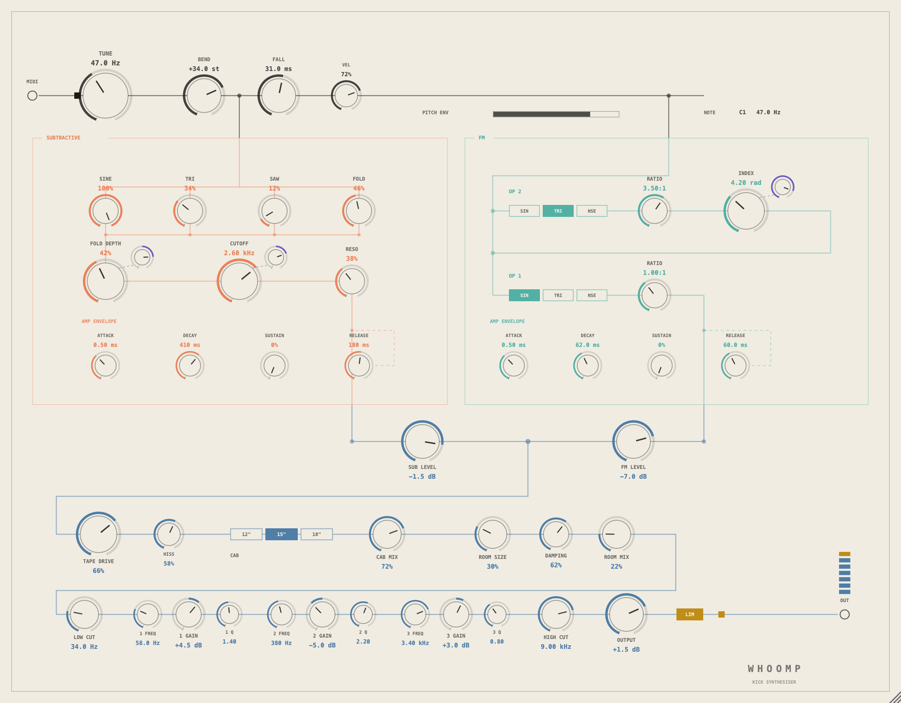

# Whoomp

A kick drum synthesiser. VST3 / AU / standalone for macOS.

Two engines running off one pitch: a subtractive one — four band-limited shapes
off a single oscillator, through a resonant filter — and a two-operator FM one.
They are summed, driven through a cassette deck, put in front of a speaker
cabinet in a small room, and shaped by three bells and a pair of cuts. Each
engine has its own ADSR; the pitch envelope that makes a kick a kick is shared,
because a drum has one pitch.



## Install

Copy the plug-ins where your host looks for them:

```
VST3  ->  ~/Library/Audio/Plug-Ins/VST3/
AU    ->  ~/Library/Audio/Plug-Ins/Components/
```

### Clear the quarantine

Any build you did not compile yourself carries an ad-hoc signature, not an Apple
Developer ID. macOS flags anything downloaded from the internet as quarantined,
and Gatekeeper then refuses to load the plug-in — usually **silently**, so it
simply never appears in your host and nothing explains why. Run this once after
installing:

```sh
xattr -dr com.apple.quarantine ~/Library/Audio/Plug-Ins/VST3/Whoomp.vst3 ~/Library/Audio/Plug-Ins/Components/Whoomp.component
```

Then restart your host and rescan. Building from source avoids this altogether —
a plug-in you compile yourself is never quarantined.

## The panel

The panel is the circuit. The pitch bus runs across the top because both engines
hang off it. The two engines sit side by side in their own frames because that
is what parallel means. Everything after they are summed runs in one line, in
the order the signal actually goes through it.

Size says how much a control matters. Colour says which part of the circuit it
belongs to, and nothing is coloured for any other reason:

| | |
|---|---|
| ink | pitch — not a section, the spine both sections hang on |
| coral | the subtractive engine |
| teal | the FM engine |
| violet | modulation, and only modulation |
| steel | everything after the two engines are summed |
| amber | the limiter |

Drag a knob vertically. Hold shift for a finer drag, double-click to return it
to its default, or use the scroll wheel. The window is resizable and keeps its
aspect ratio.

## Controls

### Pitch

Both engines read one frequency, so the FM part bends with the subtractive part
rather than beside it.

- **Tune** — the base frequency at the reference key. 20 Hz to 200 Hz.
- **Bend** — how far above Tune the hit starts, in semitones.
- **Fall** — how long it takes to get down. This is a time constant, not a
  finishing time: the sweep is most of the way down at three times the number on
  the knob, which is what you hear rather than what is true at the very end.
- **Vel** — how much MIDI velocity moves the level.

**C1 plays Tune as written.** Notes above and below it offset Tune by the same
interval, so the octave above your kick is a tom and you never have to give up
the tuning to play a fill. The panel shows the note it last saw and what
frequency that works out to.

### Subtractive

Four shapes off **one** phase accumulator, so they stay locked. Four free
oscillators would smear the transient the whole instrument is about.

- **Sine / Tri / Saw / Fold** — the mixer. These sum; they are not normalised,
  so four of them at 100% is four times the level, and that is deliberate. The
  output level and the limiter are downstream.
- **Fold depth** — how hard the sine is driven into the wavefolder, with a
  bipolar trim on its shoulder for how far the amp envelope moves it. Positive
  opens the fold with the hit and closes it as the drum decays; negative gives a
  click that cleans up into a tone.
- **Cutoff / Reso** — a resonant lowpass, with a bipolar trim for how many
  octaves the amp envelope sweeps it.
- **Attack / Decay / Sustain / Release** — the amp envelope. See *Envelopes*.

### FM

Op 2 into op 1. Both operators run at their ratio times the same swept pitch.

- **Op 2 / Op 1 shape** — sine, triangle or noise.
- **Ratio** — 0.25:1 to 16:1, per operator.
- **Index** — modulation depth in radians, with a trim for how much of it the FM
  envelope owns. At the default the envelope owns all of it, which is what puts
  the click at the front of an FM kick.
- **Attack / Decay / Sustain / Release** — the FM envelope. It is the amplitude
  envelope of op 1 *and* the thing that collapses the index.

Noise has no phase to modulate, so a noise **modulator** gives phase noise on
the carrier — a broadband click — and a noise **carrier** is ring-modulated by
op 2 instead, which keeps op 2 audible in the one place phase modulation cannot
reach it.

### Envelopes

Both are exponential, not linear. A linear decay to silence does not sound like
a drum.

**With Sustain at zero, note-off does nothing.** There is nothing for a release
to release — the decay is already on its way to zero, and cutting it short would
mean the length of the drum came from how long you held the key rather than from
the decay knob. So an envelope with S at zero is a one-shot, and lifting S off
zero is what turns the R back on.

### The chain

In this order, and the panel draws it in this order:

- **Tape drive** — gain into an asymmetric soft clip, with a head bump under it
  and the top end coming off as it goes: 18 kHz open, down to a cassette's
  4.5 kHz cranked. Level is compensated by RMS rather than by peak, because
  saturation is *supposed* to collapse the crest factor.
- **Hiss** — how much tape noise the drive brings with it. It scales with the
  square of the drive and rides the voice's own envelope with about a third of a
  second of tail, so a loaded instance sitting still is silent. It is the tape
  you can hear running, not a noise floor in your mix that never goes away.
- **Cab** — 12", 15" or 18", each a highpass, a bump, a mid scoop and a lowpass.
  **Cab mix** blends it in; at zero the section is out of the way.
- **Room** — a short one. Four combs and two allpasses a side, fed through a
  fixed 180 Hz highpass, because sending a 50 Hz drum into 12 ms combs gives
  comb filtering on the fundamental rather than a room. **Size** buys mostly
  tail and a little level; **Damping** takes the top off that tail. The wet is
  added to the dry rather than crossfaded with it — a room does not take the
  drum away, it puts something behind it.
- **EQ** — low cut, three bells, high cut. It sits *behind* the room, so it
  shapes the room too. Both cuts default to out of the way, and a bell at 0.0 dB
  is bypassed rather than computed.
- **Output** and **LIM** — the limiter is off by default. A kick running hot into
  the DAW is often what you want, and the host has somewhere to put it.

## How it works

**One voice.** A kick is one drum. Playing a second note retriggers the first,
resetting both oscillator phases so every hit starts at the same place in the
cycle — a drum whose first quarter-cycle is a different shape every time is a
drum with an inconsistent transient, and the transient is the whole thing. A
second simultaneous kick is a second instance.

**Twice oversampled, but only where it matters.** The voice and the tape
saturator run at twice the host rate and come back down through a 31-tap
linear-phase halfband. The pitch envelope starts a kick several octaves up, and
an uncorrected saw at 800 Hz — or a wavefolder at any pitch — folds enough
rubbish back down to sit right on top of the fundamental. Everything after the
tape is linear, so it stays at the host rate where it belongs.

The halfband is designed at startup from a windowed sinc rather than carried as
a table of constants: the design is three lines and the constants would be three
lines of numbers nobody could check. Its group delay is the plug-in's entire
reported latency — 7 samples.

**Saw is polyBLEP-corrected; triangle is not.** A triangle is continuous in
value and breaks only in slope, so its partials fall off as 1/n² where a saw's
fall off as 1/n. At twice the rate that is already below where the saw needs
help, and building the triangle by integrating a corrected square would trade
the aliasing for a DC drift a kick's first cycle cannot afford.

**MIDI is sample-accurate.** The block is split at every event. At a 512-sample
buffer, whole-block granularity would move hits by up to 10 ms, and this is a
drum.

**Coefficients are only redesigned when a knob moved.** The EQ, the cabinet and
the room cache what they were built from; the tape's head bump is the exception,
redesigned whenever drive changes, because drive is the knob people ride.

## Build

Needs [JUCE](https://juce.com) 7 or later and CMake 3.22 or later.

```sh
cmake -S . -B build -DCMAKE_BUILD_TYPE=Release -DJUCE_DIR=/path/to/JUCE
cmake --build build -j8
```

`JUCE_DIR` defaults to `/Applications/JUCE`. The build copies the VST3, the AU
and the standalone into your user plug-in folders.

On macOS the top of `CMakeLists.txt` pins `CMAKE_OSX_ARCHITECTURES` to
`arm64;x86_64` before `project()`. Left unset, CMake targets its own
architecture — and an x86_64 CMake, which is what Intel Homebrew installs even
on Apple Silicon, then quietly produces an Intel-only plug-in that native arm64
hosts skip with no error anywhere. Check a build with `lipo -archs`, not with
`auval`, which will happily run the wrong slice under translation.

### Dev tools

```sh
cmake -S . -B build -DCMAKE_BUILD_TYPE=Release -DWHOOMP_TOOLS=ON
cmake --build build --target panel_shot dsp_check -j8

./build/panel_shot_artefacts/Release/panel_shot docs   # renders docs/panel.png
./build/dsp_check_artefacts/Release/dsp_check          # peak, RMS, tail, DC
```

`panel_shot` renders the real editor offscreen, so the panel can be checked
without a host. `dsp_check` plays one note through the real processor in each of
thirteen configurations and prints what comes out — it is what catches a filter
that blows up, a stage that leaves DC behind, or a section that turns out to do
nothing.

## Licence

MIT. Everything here — `Source/`, `tools/` and the build files — is original
work; there is no third-party DSP in this repository.
